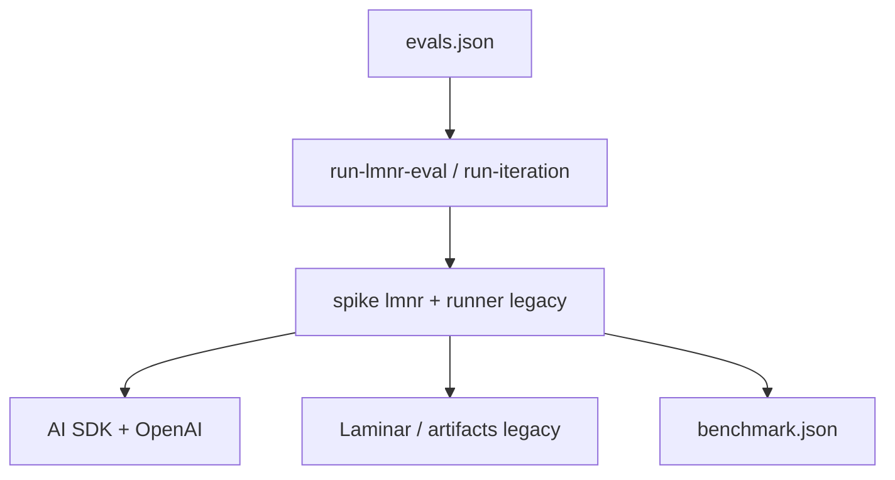
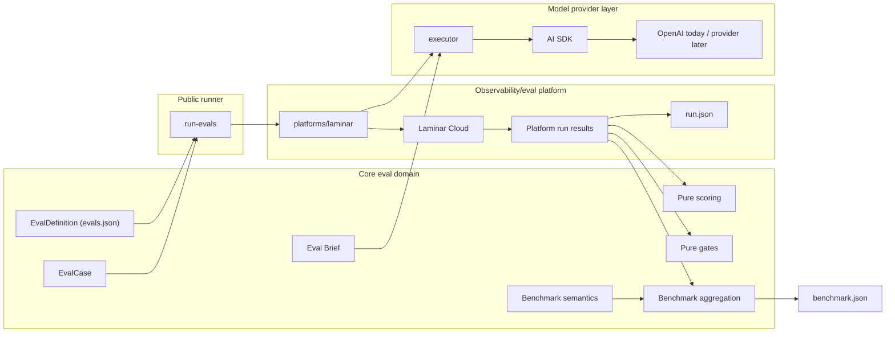
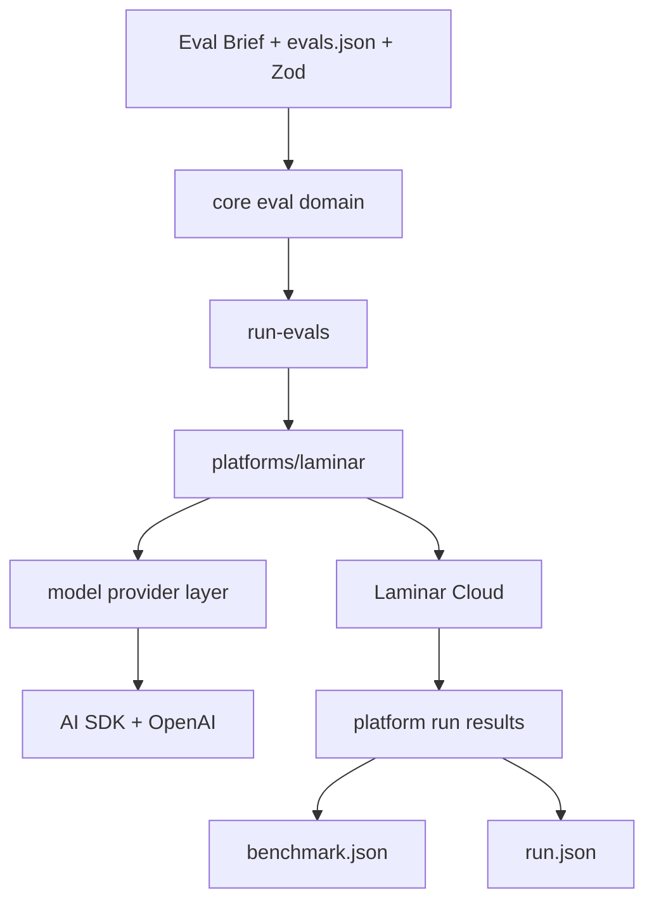
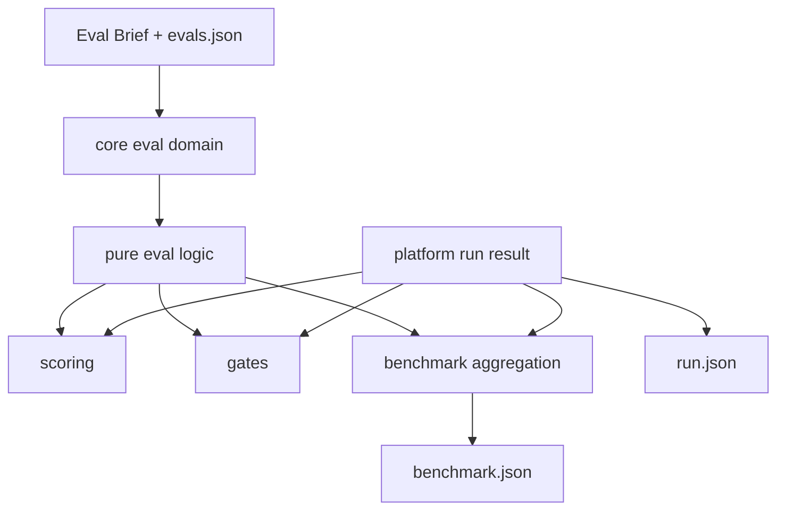
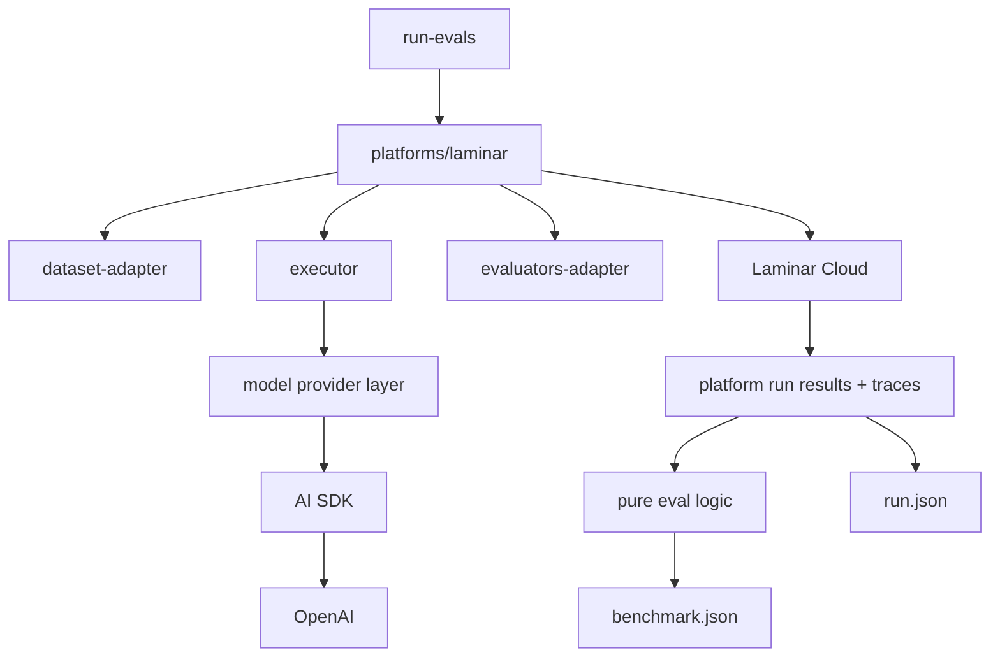

# Migración austera a Laminar con Fase 0 y gates por fase

## Resumen

### End state

Al terminar la migración:

- `run-evals` será el único comando público soportado para ejecutar evals
- Laminar quedará encapsulado como la primera **observability/eval platform**
- AI SDK seguirá siendo la **model provider layer**
- el dominio local (`Eval Brief`, `evals.json`, Zod y benchmark semantics) seguirá siendo la fuente de verdad
- el flujo soportado sólo persistirá `benchmark.json` y `run.json`

La migración se hará en **4 fases** para subir la probabilidad de éxito y evitar lock-in innecesario:

- **Fase 0**: estabilizar el estado real del runner
- **Fase 1**: aplicar **DDD Fase 3** (`límites y contextos`)
- **Fase 2**: aplicar **DDD Fase 4** y una **Fase 5 mínima** (`source of truth` + lógica pura)
- **Fase 3**: integrar Laminar y retirar el legacy

Principio rector:
- **Laminar** será una **observability/eval platform**
- **AI SDK + OpenAI** seguirán siendo la **model provider layer**
- el **core eval domain** seguirá siendo local al repo:
  - `Eval Brief`
  - `packs/core/<skill>/evals/evals.json`
  - Zod schemas
  - benchmark semantics

Decisión de austeridad:
- **no** introducir aún una interfaz genérica tipo `EvalPlatformAdapter`
- encapsular Laminar primero en `scripts/evals/platforms/laminar/`
- extraer interfaz sólo si aparece una segunda platform real

## Arquitectura objetivo

### Propósito de los Mermaid

Los Mermaid cumplen dos funciones distintas y complementarias:

- el **diagrama final de relaciones y contextos** describe el modelo estable que queremos conservar
- los **diagramas por fase** describen sólo la transición para llegar a ese estado final

### Estado actual

### Diagrama final de relaciones y contextos

### Resultado de Fase 1

### Resultado de Fase 2

### Resultado de Fase 3

## Cambios por fase

### Fase 0 — Estabilización previa
Objetivo: reducir incertidumbre antes de tocar arquitectura.

- Congelar `skill-forge` como **único piloto**.
- Hacer inventario definitivo de qué partes de `scripts/evals` siguen activas:
  - comando público actual
  - runner legacy real
  - scoring real
  - artifacts realmente usados
- Identificar y marcar como obsoletos:
  - comandos viejos aún visibles
  - docs stale
  - `dist/` o restos de spike que no sean fuente
- Fijar baseline funcional de paridad:
  - `overall_passed: true`
  - mismas decisiones trigger / non-trigger / stop-and-ask
  - `with_skill` > `without_skill`

**Gate de salida Fase 0**
- existe una lista cerrada de módulos que son:
  - `source of truth`
  - `legacy temporal`
  - `stale / ignorable`
- la baseline de `skill-forge` queda definida y verificable

### Fase 1 — Límites y Contextos
Objetivo: neutralizar naming y separar responsabilidades.

- Renombrar el comando público a `run-evals`.
- Renombrar `scripts/evals/lmnr/` a `scripts/evals/platforms/laminar/`.
- Mantener `scripts/evals/providers/` sólo para **model providers**.
- Documentar explícitamente:
  - `core eval domain`
  - `model provider layer`
  - `observability/eval platform`
  - `platform adapter`
- Actualizar docs y Mermaid para que Laminar no aparezca como backend ni como source of truth.

**Gate de salida Fase 1**
- el comando soportado del repo ya no menciona Laminar
- el árbol separa claramente `domain/`, `providers/` y `platforms/laminar/`
- docs y Mermaid cuentan la misma historia que el código

### Fase 2 — Source of Truth y lógica pura
Objetivo: desacoplar benchmark y scoring de la plataforma.

- Congelar como `source of truth`:
  - `Eval Brief`
  - `evals.json`
  - Zod schemas
  - benchmark semantics
- Extraer o consolidar como lógica pura:
  - scoring por caso
  - gates
  - benchmark aggregation
- Definir `run.json` con naming neutral:
  - `platform`
  - `run_ref`
  - `group_ref`
  - `provider`
  - `model`
  - `skill_name`
  - `eval_version`
  - `iteration`
  - `created_at`
- Mantener `benchmark.json` con la semántica actual:
  - `golden_pass_rate`
  - `negative_pass_rate`
  - `case_score_threshold`
  - `overall_passed`
  - `with_skill` vs `without_skill`
- En el flujo híbrido, conservar sólo:
  - `benchmark.json`
  - `run.json`

**Gate de salida Fase 2**
- el benchmark local ya no depende de artifacts legacy detallados
- `run.json` no contiene nombres específicos de Laminar
- si mañana cambia la platform, scoring/gates/benchmark siguen siendo reutilizables

### Fase 3 — Integrar Laminar y retirar legacy
Objetivo: hacer que Laminar sea la primera platform real sin contaminar el dominio.

- Mantener `platforms/laminar/` como implementación concreta, sin interfaz genérica extra en esta fase.
- Separar dentro de esa carpeta sólo lo necesario:
  - `dataset-adapter`
  - `executor`
  - `evaluators-adapter`
  - `report`
- Mantener AI SDK dentro del executor con contrato estable:
  - `runText({ mode, model, systemPrompt, userPrompt, files, timeoutMs })`
- Ejecutar `with_skill` y `without_skill` desde esa integración.
- Retirar el runner legacy sólo cuando `skill-forge` mantenga paridad real.

**Gate de salida Fase 3**
- `skill-forge` mantiene `overall_passed: true`
- `with_skill` sigue superando a `without_skill`
- trigger / non-trigger / stop-and-ask siguen alineados
- el flujo soportado ya no depende del runner anterior

## Interfaces y contratos
- **Comando público final**:
  - `node scripts/evals/dist/run-evals.js --skill-name <skill> --model <model>`
  - `node scripts/evals/dist/run-evals.js --file <path> --model <model>`
- **Opciones**:
  - `--group-name` opcional
- **Variables de entorno**:
  - `LMNR_PROJECT_API_KEY`
  - `OPENAI_API_KEY`
  - `EVAL_RUN_TIMEOUT_MS`
- **Contratos estables**:
  - `Eval Brief`
  - `packs/core/<skill>/evals/evals.json`
  - Zod schemas del dominio
  - `benchmark.json`
- **Contrato nuevo neutral**:
  - `run.json`

## Test plan
- `npx tsc -p scripts/evals/tsconfig.json`
- el comando valida `evals.json` antes de correr
- falla temprano si faltan credenciales, antes de crear `iteration-N`
- `skill-forge` es el único piloto hasta cerrar paridad
- `with_skill` y `without_skill` siguen siendo comparables
- `skill-forge` debe mantener `overall_passed: true`
- el benchmark local debe conservar exactamente su semántica actual
- Mermaid y docs se actualizan al cierre de cada fase

## Suposiciones y defaults
- Se usan sólo **DDD Fase 3**, **Fase 4** y una **Fase 5 mínima**.
- Laminar Cloud es la primera observability/eval platform.
- AI SDK se mantiene durante toda la migración.
- No se introduce una abstracción genérica de platform hasta que exista una segunda platform real.
- El diagrama de relaciones/contextos es el artefacto arquitectónico final; los diagramas por fase describen la transición.
- La mejor manera de acercarse al 100% de éxito es ejecutar **fase por fase con gates**, no en un bloque único.

