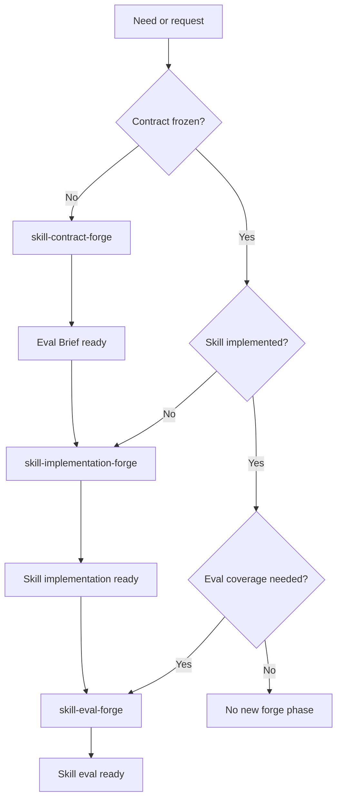
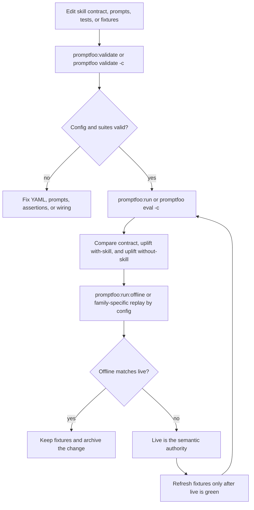

# Skills Catalog

A spec-first catalog of reusable Codex skills, supporting docs, and eval assets.

This repository is organized around three ideas:
- `packs/` contains portable skill artifacts grouped by domain.
- `openspec/` governs non-trivial repository changes with a spec-first workflow.
- `evals/` contains the Promptfoo-first evaluation scaffold for validating skill behavior.

## Architecture

### 1. Skill catalog
`packs/` is the product surface of the repo.

Each skill is a shallow folder centered on `SKILL.md`, with optional supporting assets nearby:
- `SKILL.md`
- `references/`
- `assets/`
- `agents/`
- `scripts/`
- `evals/` only when a skill explicitly owns eval definitions

Current pack groups include:
- `packs/core/` for repo bootstrap and core workflow skills such as `skill-contract-forge`, `skill-implementation-forge`, `skill-eval-forge`, `openspec-bootstrap`, and `agents-bootstrap`
- `packs/angular/skills/` for Angular-focused skills
- `packs/react/` for React-focused skills
- `packs/javascript/`, `packs/typescript/`, and `packs/zod/` for language and validation skills

The catalog is designed so consumers can install only the skills they need.

### 2. OpenSpec workflow layer
`openspec/` is the repository change-management layer.

It is used to:
- define non-trivial changes before implementation
- keep proposal, design, tasks, and resulting specs aligned
- archive completed changes into stable specs under `openspec/specs/`

Important pieces:
- `openspec/config.yaml`: workspace config
- `openspec/AGENTS.override.md`: OpenSpec operating rules for this repo
- `openspec/specs/`: stable repository capabilities
- `openspec/changes/archive/`: completed change history

### 3. Evaluation runtime boundary
`evals/` is the stable home of the repository evaluation scaffold.

Promptfoo is the supported eval runtime for this repo. The active engine boundary lives under:
- `evals/engines/promptfoo/`

High-level shape:
- `evals/contracts/` for stable eval contracts
- `evals/engines/promptfoo/fixtures/` for reusable offline inputs and model outputs
- `evals/engines/promptfoo/` for engine-specific families, prompts, assertions, and generated outputs

For active runtime details, treat [evals/README.md](/C:/Users/Jorge/WebstormProjects/skills-catalog/evals/README.md) as the source of truth.

### 4. Repository tooling
`scripts/` contains small repo-level utilities that support the catalog without becoming a separate framework.

Current tooling includes the skill metadata validator:
- [validate-skill-metadata.ts](/C:/Users/Jorge/WebstormProjects/skills-catalog/scripts/validate-skill-metadata.ts)
- [frontmatter.ts](/C:/Users/Jorge/WebstormProjects/skills-catalog/scripts/skill-metadata/frontmatter.ts)
- [validate-file.ts](/C:/Users/Jorge/WebstormProjects/skills-catalog/scripts/skill-metadata/validation/validate-file.ts)

The validator currently checks:
- frontmatter presence and YAML validity
- required `name` and `description`
- optional `metadata.short-description`
- `name` matching the containing skill directory

## Repository layout

```text
skills-catalog/
  packs/
    core/
    angular/
    react/
    javascript/
    typescript/
    zod/
  openspec/
    specs/
    changes/
  evals/
    contracts/
    engines/
      promptfoo/
  scripts/
    skill-metadata/
  AGENTS.md
  README.md
  package.json
```

## Working model

### For skill consumers
Install the specific skill folders you want into either:
- repo-scoped: `.codex/skills/<skill>/SKILL.md`
- user-scoped: `~/.codex/skills/<skill>/SKILL.md`

This keeps the catalog modular and pack-based.

### For repository contributors
Use OpenSpec for non-trivial changes.

In practice:
1. define the change in `openspec/changes/<slug>/`
2. implement only what the change artifacts require
3. verify with repo gates
4. archive the change so the resulting capability lands in `openspec/specs/`

The repo-specific operating rules live in:
- [AGENTS.md](/C:/Users/Jorge/WebstormProjects/skills-catalog/AGENTS.md)
- [openspec/AGENTS.override.md](/C:/Users/Jorge/WebstormProjects/skills-catalog/openspec/AGENTS.override.md)

### Repo-scoped subagents
This repo tracks a small repo-scoped subagent baseline under `.codex/` for day-to-day read-heavy work:
- `.codex/config.toml`
- `.codex/agents/repo-mapper.toml`
- `.codex/agents/openspec-preflight.toml`
- `.codex/agents/promptfoo-drift-checker.toml`

These defaults are intentionally narrow:
- `repo_mapper` locates the minimum relevant files before edits.
- `openspec_preflight` checks whether a slug is ready for validate, apply, review, or archive.
- `promptfoo_drift_checker` compares contract and uplift suites for semantic drift.

Cost note:
- the goal is to shift repo exploration and review off the main frontier agent onto `gpt-5.4-mini`
- this can reduce expensive main-agent usage in repeated read-heavy tasks
- it does not guarantee lower total token usage on every run because subagents still do their own model and tool work

Use the repo-scoped subagents when the task is mostly reading, comparing, or preflighting. Keep the main agent for integration, ambiguity resolution, and final editing decisions.

## Skill-forge workflow

This repo uses the forge workflow as its default authoring pipeline:

1. `skill-contract-forge`
   - objective: freeze the boundary of one skill before implementation
   - stops at `Eval Brief ready`

2. `skill-implementation-forge`
   - objective: implement or refactor one named skill from an approved contract artifact
   - stops at `Skill implementation ready`

3. `skill-eval-forge`
   - objective: author or refactor eval coverage for one named implemented skill
   - stops at `Skill eval ready`

These phases are intentionally separated. Do not merge contract definition, skill implementation, and eval authoring into one inseparable step unless explicitly required.

### Contract-to-implementation handoff

The current repo handoff between contract and implementation is intentionally explicit:
- `skill-contract-forge` now freezes canonical `skill.name` and `skill.description` in the approved brief.
- the approved brief artifact is the only required contractual handoff between contract and implementation; auxiliary repo-local authoring refs are not part of the durable handoff
- New-style repo-native briefs also freeze `authoring.packageShape` with:
  - `requiredFiles`
  - `supportFolders`
- `supportFolders` should stay minimal:
  - core behavior stays in `SKILL.md`
  - consultation material goes in `references/`
  - repetitive or fragile logic goes in `scripts/`
  - templates or output resources go in `assets/`
  - `agents/` is opt-in only when metadata, UI, or dependency-facing files are materially required
- If `supportFolders` includes `agents`, the approved brief must also freeze:
  - `authoring.interface.display_name`
  - `authoring.interface.short_description`
  - `authoring.interface.default_prompt`
- if long examples, templates, or reference material must survive into later phases, the contract should freeze that need through `packageShape` so implementation materializes them into `references/` or `assets/` rather than relying on upstream local file refs

`skill-implementation-forge` now treats that handoff as authority:
- when `authoring.packageShape` exists, implementation obeys it and does not widen the package
- when a legacy approved brief omits `packageShape`, implementation falls back conservatively to `SKILL.md` only
- if a contract requires `agents` but omits `authoring.interface`, implementation must stop and ask instead of inventing `agents/openai.yaml`
- trigger-path implementation closure still requires `npm run validate:skill-metadata` before `Skill implementation ready`

`skill-eval-forge` reads the same portable boundary downstream:
- eval authoring requires the approved brief artifact, the implemented skill, and active eval context
- it should read durable examples/templates from the implemented package when the contract froze `references/` or `assets/`
- it should not require the original repo-local authoring files from the contract phase

### Workflow at a glance



### Policy source
Treat [AGENTS.md](/C:/Users/Jorge/WebstormProjects/skills-catalog/AGENTS.md) as the normative workflow policy for:
- phase preconditions
- terminal markers
- built-ins vs forge behavior
- global forge guardrails

`README.md` is the human-facing summary, not the canonical policy source.

### Built-in Codex support
- Built-in planning is support for exploration and decomposition before entering a forge phase.
- `skill-creator` is a general baseline and fallback reference, not the normative repo workflow.
- `skill-installer` is operational support outside the functional `contract -> implementation -> eval` pipeline.

## Promptfoo eval flow



Operating rule:
- `npm run promptfoo:validate` is the canonical public contract-validate entrypoint.
- `npm run promptfoo:run` is the canonical public live semantic gate.
- `npm run promptfoo:run:offline` is the canonical public replay and smoke path.
- direct `promptfoo -c <config>` execution is the standard path for family-specific validation and runs outside the small public npm surface.
- if live and offline disagree, live wins.

For the current supported Promptfoo command surface, see [evals/README.md](/C:/Users/Jorge/WebstormProjects/skills-catalog/evals/README.md).

## Commands

Core commands:
- `npm run test`
- `npm run test:run`
- `npm run validate:skill-metadata`

For eval commands, see [evals/README.md](/C:/Users/Jorge/WebstormProjects/skills-catalog/evals/README.md).

## What this repo optimizes for

- small, reviewable, spec-driven changes
- portable skill artifacts
- explicit validation boundaries
- low drift between implementation, specs, and eval scaffolding
- phase-separated skill authoring with explicit handoffs

## References

- [OpenAI: Testing Agent Skills Systematically with Evals](https://developers.openai.com/blog/eval-skills/)
- [OpenAI Codex CLI reference](https://developers.openai.com/codex/cli/reference/)
- [OpenAI Codex changelog](https://developers.openai.com/codex/changelog/)
- [OpenAI Codex: AGENTS.md guide](https://developers.openai.com/codex/guides/agents-md/)
- [OpenAI Codex: Agent skills](https://developers.openai.com/codex/skills/)
- [OpenAI Codex: Subagents](https://developers.openai.com/codex/subagents)
- [OpenAI Codex: Subagent concepts](https://developers.openai.com/codex/concepts/subagents)
- [OpenAI: Unrolling the Codex agent loop](https://openai.com/index/unrolling-the-codex-agent-loop/)
