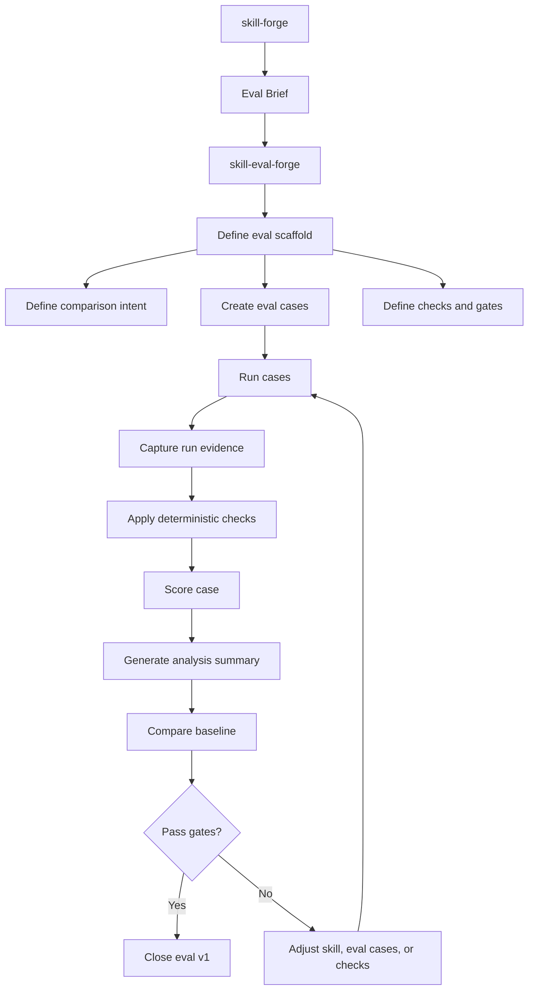
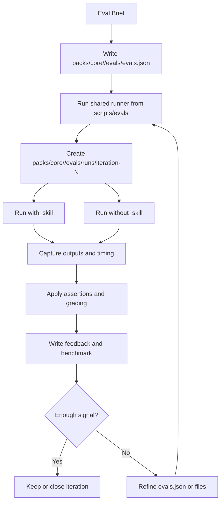

# Eval Domain -- Blueprint: Skill Eval v1

## 1. Purpose

This blueprint defines the **v1 eval system for skills** in this repo in a way that is:

- simple
- repeatable
- provider-agnostic
- decoupled from any specific platform
- compatible with rebuilding the eval scaffold from scratch

This document **does not describe how to create a skill**. It describes **how to measure skill behavior** and how to separate authoring from eval work.

> This is the governing eval document for this repo.

---

## 2. Two adopted external sources

### 2.1 Eval scaffold architecture

The main external reference for scaffold architecture is **Agent Skills - Evaluating skill output quality**.

For the first phase we adopt:

- small and repeatable evals,
- baseline comparison,
- small and clear cases,
- verifiable assertions,
- visible timing and results,
- short evidence-driven iteration loops.

This source governs **how the eval is structured**.

### 2.2 Work and refinement workflow

The main external reference for workflow is the OpenAI **eval-skills** blog post.

We adopt it only when it simplifies the work:

- define success before implementation,
- separate outcome / process / style / efficiency,
- work with small checks,
- compare runs,
- grow from real failures.

We do not adopt filenames, commands, or tool-specific setup from that source.

### 2.3 Simplification rule

- If there is doubt in an early phase, start from `Evaluating Skills`.
- The OpenAI blog comes after that, as a work discipline.
- Final repo adaptation is defined by this blueprint and the rest of `plans/`.

---

## 3. Current repo state

The legacy eval runtime was deliberately removed.

Therefore:

- there is no existing harness that must be preserved,
- the scaffold must not be rebuilt from deleted paths or scripts,
- the new eval architecture must come from contract and workflow, not from inherited implementation.

---

## 4. Separation of responsibilities

### 4.1 Skill Authoring (`skill-forge`)

Responsible for:

- creating or refactoring a skill,
- defining its **single job**,
- freezing its **trigger boundary**,
- defining **success model**,
- preparing **activation probes**,
- running **manual dogfooding**,
- producing an **Eval Brief**.

It does not implement the full eval infrastructure.

### 4.2 Skill Eval Authoring (`skill-eval-forge`)

Responsible for:

- building **eval v1** from the handoff,
- defining the concrete eval scaffold for the skill,
- curating eval cases,
- implementing checks,
- setting gates,
- generating analysis summary,
- maintaining baseline.

### 4.3 Shared Eval Runtime

Responsible for:

- running cases,
- using the provider adapter,
- capturing run evidence,
- supporting scoring and analysis.

It does not define skill domain behavior and does not replace the handoff.

---

## 5. Eval Brief

`Eval Brief` is produced by `skill-forge` and consumed by `skill-eval-forge`.

It is a boundary artifact for authoring intent only.

It is not `evals.json`.

It does not contain:

- runner configuration,
- benchmark layout,
- grading implementation,
- shared runtime behavior.

It must contain:

- the skill objective,
- `single job`,
- trigger boundary,
- nearby negative cases,
- non-goals,
- outcome goals,
- process goals,
- style goals,
- efficiency goals,
- activation probes,
- seed eval intent.

`skill-eval-forge` turns that authoring intent into concrete eval definition and cases.

---

## 6. Minimal eval scaffold architecture

The eval system is organized in four layers.

### 6.1 Definition Layer

Contains:

- eval definition,
- eval cases,
- expected behavior,
- comparison intent,
- gates,
- failure taxonomy.

This layer is the source of truth for a skill eval.

### 6.2 Execution Layer

Responsible for running cases.

Includes:

- shared runner under `scripts/evals/`,
- provider adapter,
- result capture,
- run evidence.

Initial adapter:

- AI SDK.

### 6.3 Scoring Layer

Responsible for measuring behavior.

Includes:

- deterministic checks,
- per-case score,
- failure classification.

v1 baseline:

- deterministic checks first,
- judge model optional later.

### 6.4 Analysis Layer

Responsible for useful human review.

Includes:

- analysis summary,
- baseline diff,
- per-case summary,
- per-failure-type summary.

---

## 7. Minimal file scaffold

The first scaffold should stay small and readable.

### 7.1 Skill artifacts

- `packs/core/skill-forge/`
- `packs/core/skill-eval-forge/`

### 7.2 Eval definition next to the skill

- `packs/core/<skill-name>/evals/evals.json`
- `packs/core/<skill-name>/evals/files/`

### 7.3 Shared runner code

- `scripts/evals/read-evals.ts`
- `scripts/evals/run-iteration.ts`
- supporting shared modules under `scripts/evals/`

### 7.4 Iteration workspace

Each iteration must be comparable and reviewable without ambiguity.

Minimum structure:

- `packs/core/<skill-name>/evals/runs/iteration-1/benchmark.json`
- `packs/core/<skill-name>/evals/runs/iteration-1/<case-id>/with_skill/`
- `packs/core/<skill-name>/evals/runs/iteration-1/<case-id>/without_skill/`
- `packs/core/<skill-name>/evals/runs/iteration-1/<case-id>/outputs/`
- `packs/core/<skill-name>/evals/runs/iteration-1/<case-id>/timing.json`
- `packs/core/<skill-name>/evals/runs/iteration-1/<case-id>/grading.json`
- `packs/core/<skill-name>/evals/runs/iteration-1/<case-id>/feedback.json`

---

## 8. Minimal eval artifact shapes

### 8.1 Eval definition

It must answer at minimum:

- what is being measured,
- what baseline it compares against,
- how `with_skill` and `without_skill` are compared,
- which gates apply,
- which scoring strategy it uses,
- which case groups it defines.

In the first implementation, the concrete fields should stay small and explicit, for example:

- comparison intent,
- gates,
- `golden`,
- `negative`.

### 8.2 Eval case

It must include at minimum:

- `id`
- `prompt`
- `expected_output`
- `should_trigger`
- `stop_at`
- `assertions`
- optional `files`

In the first implementation, these cases live together in `evals.json` next to the skill, typically grouped into `golden` and `negative`.

`evals.json` is not the same artifact as iteration outputs written under `packs/core/<skill-name>/evals/runs/`.

### 8.3 Run evidence

It must include at minimum:

- executed input,
- captured output,
- provider/model used,
- relevant run metadata.

### 8.4 Timing artifact

It must include at minimum:

- duration,
- tokens or another available cost measure,
- enough data to compare `with_skill` and `without_skill`.

### 8.5 Grading artifact

It must include at minimum:

- evaluated assertions,
- `PASS` or `FAIL` per assertion,
- readable evidence per assertion,
- total case score.

### 8.6 Feedback artifact

It must include at minimum:

- short human observations,
- the most visible problems,
- suggestions for the next iteration.

### 8.7 Benchmark artifact

It must include at minimum:

- iteration-level aggregate,
- `with_skill` vs `without_skill` comparison,
- pass-rate summary,
- score summary,
- timing summary.

---

## 9. Initial recommended stack

- Node
- TypeScript
- Zod
- AI SDK
- offline eval

The stack implements the scaffold. It does not define the domain.

---

## 10. Case taxonomy

### Golden set

Cases that must always pass.

### Negative set

Cases where the skill **must not trigger**.

---

## 11. Failure taxonomy (v1)

- `skill_regression`
- `grader_fragility`
- `dataset_gap`

`provider_variance` remains out of v1.

---

## 12. v1 closing gates

To close eval v1:

- golden set: **100% pass**
- negative set: **100% pass**
- case score threshold: **0.75**
- reproducible baseline

---

## 13. Eval case growth rules

New cases only come from:

- real regressions,
- manual dogfooding,
- real functional boundaries,
- real baseline comparisons.

Do not add:

- decorative prompts,
- semantic duplicates,
- speculative traps.

---

## 14. Definition of Done -- Skill Authoring

A skill is ready to move to eval when all of these exist:

- clear single job,
- stable boundary,
- defined success model,
- activation probes,
- Eval Brief.

## 15. Definition of Done -- Eval v1

Eval v1 is closed when all of these exist:

- small curated eval cases,
- repeatable runner,
- run evidence,
- deterministic checks,
- analysis summary,
- baseline,
- explicit gates.

---

## 16. Conceptual flow

## 17. Iteration flow

## 18. First implementation rule

The first implementation should prioritize:

1. an eval scaffold inspired by `Evaluating Skills`,
2. deterministic checks,
3. baseline/comparison,
4. reproducible run evidence,
5. small iteration artifacts.

The extra workflow from the OpenAI blog only comes in when it simplifies the work rather than complicating it.
