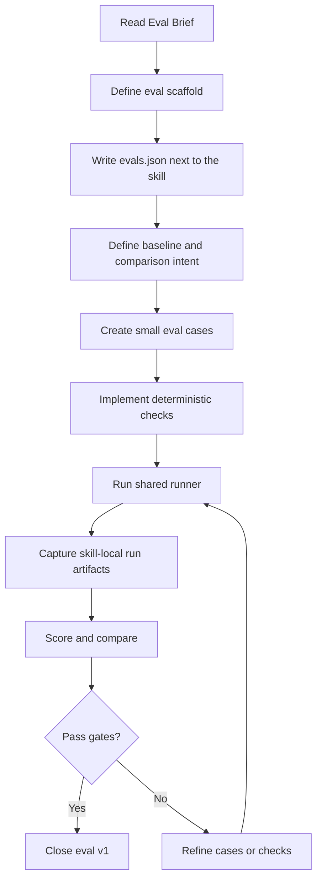

> Complements: `02-eval-blueprint.md`

# Skills Domain -- Workflow: Apply Blueprint

## 1. Purpose

This document fixes the working workflow used to apply the system agreements to real skills.

It does not redefine the blueprint. It executes it.

---

## 2. General rule

The workflow answers:

- what do I do first,
- what do I do next,
- which artifacts do I produce,
- when do I compare,
- when do I refactor,
- when do I pass work to eval,
- and how does the refinement loop enter.

---

## 3. Workflow simplification rule

For a first phase:

- start from the base workflow in `Evaluating Skills`,
- keep the loop small and offline,
- compare early,
- and only then add refinements from the `eval-skills` blog.

The OpenAI blog is used to improve the work, not to widen the first implementation.

---

## 4. Workflow for existing skills

Use when the skill already exists and was created before the current approach.

### 4.1 Sequence

1. Read the current `SKILL.md`.
2. Extract trigger, steps, decisions, stop conditions, and outputs.
3. Create an as-is Mermaid of the current flow.
4. Compare it to the frozen blueprint.
5. Perform gap analysis.
6. Freeze any missing or corrected rules.
7. Create a to-be Mermaid.
8. Adjust the skill.
9. Prepare `Eval Brief`.
10. Hand off to `skill-eval-forge` if appropriate.

### 4.2 Goal

Do not rewrite from scratch by default.

First understand what the skill does today, then align it to the agreed destination.

---

## 5. Workflow for new skills

Use when the skill does not exist yet.

### 5.1 Sequence

1. Start from the frozen blueprint.
2. Define the `single job`.
3. Define trigger boundary.
4. Define non-goals.
5. Define success model.
6. Define activation probes.
7. Identify nearby negative cases.
8. Create a to-be Mermaid.
9. Implement the skill.
10. Prepare `Eval Brief`.
11. Hand off to `skill-eval-forge` if appropriate.

### 5.2 Goal

A new skill does not need an as-is Mermaid.

It should be born already aligned with the blueprint and with an explicit target flow.

---

## 6. Workflow for eval authoring

Use when `Eval Brief ready` already exists.

### 6.1 Base sequence

1. Read `Eval Brief`.
2. Write or update `packs/core/<skill-name>/evals/evals.json`.
3. Define comparison intent and target baseline.
4. Create small curated `golden` and `negative` cases.
5. Implement deterministic checks.
6. Run the shared runner in `scripts/evals/` to create `packs/core/<skill-name>/evals/runs/iteration-N/`.
7. Run `with_skill` and `without_skill` for each case.
8. Capture run evidence.
9. Compare against baseline.
10. Adjust the skill, eval cases, or checks based on failures.
11. Close eval v1 once the gates pass.

### 6.2 Complementary workflow from the OpenAI blog

The `eval-skills` blog enters here as refinement discipline, not as base architecture.

We adopt from it:

- define success before refining,
- separate outcome / process / style / efficiency when it actually clarifies the case,
- work with small checks,
- iterate from real failures,
- compare runs before expanding coverage.

If applying those rules makes the first eval version more complex, postpone them.

### 6.3 Mermaid for the eval workflow

---

## 7. Role of Mermaid inside the workflow

Mermaid does not replace the blueprint.

Its role is operational and visual.

### 7.1 As-is Mermaid

Use it for:

- existing skills,
- understanding the current real flow,
- detecting mixed responsibilities,
- making implicit behavior visible.

### 7.2 To-be Mermaid

Use it for:

- new skills,
- refactors of existing skills,
- validating that the target flow has a clear sequence,
- checking handoffs and stop conditions.

### 7.3 Eval Mermaid

Use it for:

- `skill-eval-forge`,
- making the eval scaffold visible,
- showing execution, scoring, analysis, and baseline,
- checking that authoring is not mixed with runtime.

---

## 8. Refactor rule

Do not refactor an existing skill directly against an abstract ideal.

First:

- understand it,
- visualize it,
- compare it,
- then adjust it.

---

## 9. Eval scaffold rebuild rule

Do not rebuild the eval scaffold from the deleted legacy runtime.

First:

- apply the blueprint,
- fix the architecture using Agent Skills,
- use the OpenAI blog only when it helps the workflow,
- and only then implement new code.

---

## 10. Expected output of the workflow

The workflow ends when there is:

- a skill aligned with the agreements,
- a valid Mermaid of the correct flow,
- an `Eval Brief` ready,
- a clear boundary into eval work,
- and a closed eval v1 when appropriate.
