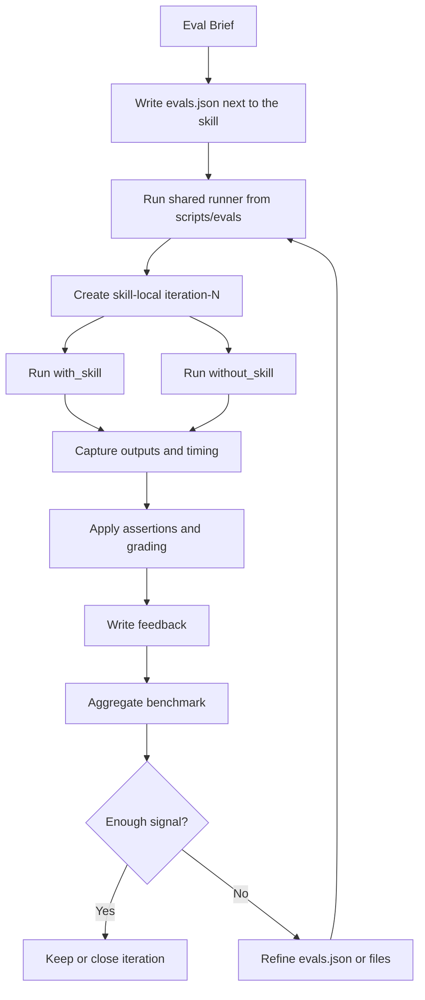

> Complements: `02-eval-blueprint.md`

# Skills Domain -- Artifacts Reference

## 1. Purpose

This document fixes which artifacts we use to understand, refactor, and implement skills in the system.

---

## 2. Layers

### 2.1 Agreements

Stable definition artifacts:

- frozen blueprint,
- responsibility agreements,
- `Eval Brief`,
- Definition of Done.

### 2.2 Workflow

Process execution artifacts:

- existing-skill checklist,
- new-skill checklist,
- gap analysis,
- adjustment plan,
- eval scaffold plan.

### 2.3 Execution artifacts

Concrete work artifacts:

- `SKILL.md`,
- as-is Mermaid,
- to-be Mermaid,
- `Eval Brief`,
- `evals.json`,
- checks,
- run evidence,
- timing,
- grading,
- feedback,
- benchmark,
- analysis summary,
- baseline.

---

## 3. Skill Mermaid vs eval Mermaid

### 3.1 Skill Mermaid

It answers:

- how the skill works,
- which steps it follows,
- which decisions it makes,
- which stop conditions it has,
- where its responsibility ends,
- where it leaves the handoff.

It is an authoring / refactor workflow artifact.

### 3.2 Eval Mermaid

It answers:

- how the handoff is consumed,
- where `evals.json` lives,
- how the iteration workspace is created,
- how execution runs,
- how evidence is captured,
- how checks are applied,
- how analysis summary is generated,
- how baseline is consolidated.

It is an evaluation workflow artifact.

---

## 4. Boundary rule between diagrams

The correct boundary is:

- output of the skill Mermaid = `Eval Brief ready`
- input of the eval Mermaid = `Eval Brief ready`

This avoids mixing responsibilities.

---

## 5. Artifact distinction rule

These three artifacts must stay separate:

- `Eval Brief`: authoring intent only, produced by `skill-forge`
- `evals.json`: concrete skill-local eval definition and case list, produced or refined by `skill-eval-forge`
- workspace outputs: captured run artifacts under `packs/core/<skill-name>/evals/runs/`

They are connected, but they are not interchangeable.

---

## 6. Minimal file scaffold

### 6.1 Skill artifacts

- `packs/core/skill-forge/SKILL.md`
- `packs/core/skill-eval-forge/SKILL.md`

### 6.2 Eval definition next to the skill

- `packs/core/<skill-name>/evals/evals.json`
- `packs/core/<skill-name>/evals/files/`

### 6.3 Shared runner code

- `scripts/evals/read-evals.ts`
- `scripts/evals/run-evals.ts`
- supporting shared modules under `scripts/evals/`

### 6.4 Iteration workspace

- `packs/core/<skill-name>/evals/runs/iteration-1/benchmark.json`
- `packs/core/<skill-name>/evals/runs/iteration-1/<case-id>/with_skill/`
- `packs/core/<skill-name>/evals/runs/iteration-1/<case-id>/without_skill/`
- `packs/core/<skill-name>/evals/runs/iteration-1/<case-id>/outputs/`
- `packs/core/<skill-name>/evals/runs/iteration-1/<case-id>/timing.json`
- `packs/core/<skill-name>/evals/runs/iteration-1/<case-id>/grading.json`
- `packs/core/<skill-name>/evals/runs/iteration-1/<case-id>/feedback.json`

---

## 7. Which artifact is used when

### 7.1 Existing skill

Use:

- current `SKILL.md`,
- as-is Mermaid,
- gap analysis,
- to-be Mermaid,
- adjusted `SKILL.md`.

### 7.2 New skill

Use:

- frozen blueprint,
- minimum rules,
- to-be Mermaid,
- new `SKILL.md`,
- `Eval Brief`.

### 7.3 Eval

Use:

- `Eval Brief`,
- `packs/core/<skill-name>/evals/evals.json`,
- deterministic checks,
- run evidence,
- timing,
- grading,
- feedback,
- benchmark,
- analysis summary,
- baseline.

---

## 8. Minimal artifact shapes

### 8.1 Evals definition

It must answer:

- what it measures,
- which baseline it compares against,
- how `with_skill` and `without_skill` are compared,
- which gates apply,
- which scoring it uses,
- which cases it defines.

In the first implementation it should make the case groups explicit, typically:

- `golden`
- `negative`

### 8.2 Eval case

It must include at minimum:

- `id`
- `prompt`
- `expected_output`
- `should_trigger`
- `stop_at`
- `assertions`
- optional `files`

In the first implementation these cases live together in `evals.json` next to the skill.

This is a concrete eval artifact, not an authoring-boundary artifact.

### 8.3 Run evidence

It must include at minimum:

- executed input,
- captured output,
- provider/model used,
- relevant metadata.

### 8.4 Timing

It must include at minimum:

- duration,
- available cost measure,
- comparable data between `with_skill` and `without_skill`.

### 8.5 Grading

It must include at minimum:

- evaluated assertions,
- `PASS` or `FAIL` per assertion,
- readable evidence per assertion,
- total score.

### 8.6 Feedback

It must include at minimum:

- short human observations,
- most visible problems,
- suggestions for the next iteration.

### 8.7 Benchmark

It must include at minimum:

- iteration-level aggregate,
- `with_skill` vs `without_skill` comparison,
- pass-rate summary,
- score summary,
- timing summary.

---

## 9. Mermaid for the iteration loop

---

## 10. Artifact maintenance rule

If a structural rule changes:

- first update Agreements,
- then update Workflow,
- then update the concrete artifacts.

If only an operational practice changes:

- update Workflow,
- then update the concrete artifacts.

---

## 11. Expected result

With this separation, any agent or person should be able to distinguish without ambiguity:

- what is a stable decision,
- what is a work process,
- what is a concrete execution artifact,
- how one eval iteration is organized,
- and what belongs to eval architecture versus refinement workflow.
