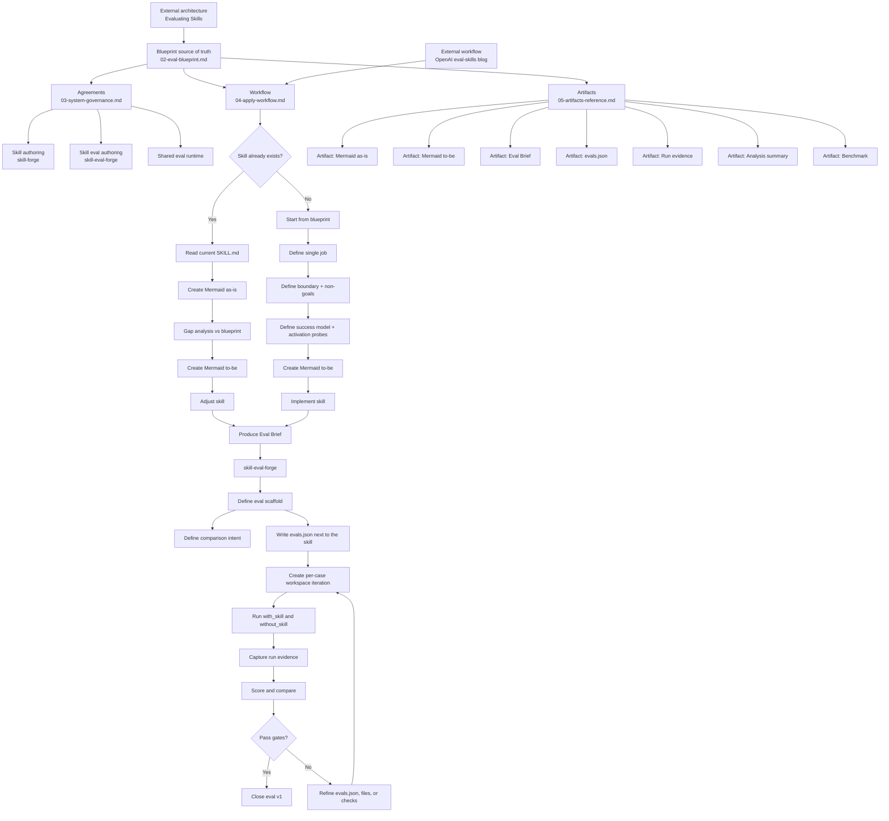

> Complements: `02-eval-blueprint.md`

# Skills System -- Map

## Purpose

This document maps the complete system so that the following layers do not get mixed again:

- Blueprint / source of truth
- Agreements
- Workflow
- Artifacts
- Skill authoring
- Skill eval authoring
- Shared eval runtime

## Main rule

- The blueprint defines the eval system adapted to this repo.
- Agreements define stable ecosystem rules.
- Workflow defines how to apply those rules.
- Artifacts define which deliverables we use.
- `Evaluating Skills` informs the eval scaffold architecture.
- The OpenAI `eval-skills` blog informs refinement workflow.
- The skill Mermaid and the eval Mermaid are different artifacts.

## System map

## Key boundary

The boundary between skill authoring and eval authoring is:

- output of `skill-forge`: `Eval Brief ready`
- input of `skill-eval-forge`: `Eval Brief ready`

## First-phase rule

In a first phase:

- `Evaluating Skills` governs architecture,
- the OpenAI blog only comes in to simplify workflow,
- and the runtime is implemented with Node, TypeScript, Zod, and AI SDK.

## Reset rule

The deleted legacy runtime is not part of this map and must not be reintroduced as an implementation base.

## How to read the package

1. Read `01-start-here.md` first.
2. Then read `02-eval-blueprint.md`.
3. Then `04-apply-workflow.md`.
4. Then `03-system-governance.md`.
5. Use `05-artifacts-reference.md` as reference.
6. Use this document to understand the complete map without mixing layers.

