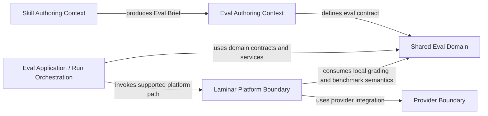

> Complements: `06-system-map.md`, `07-laminar-migration-versions.md`

# Eval Runtime -- V3 Context Map

## Purpose

This document defines the bounded contexts and dependency rules for the supported eval runtime in the Laminar V3 end state.

Use it to keep these responsibilities separate:

- skill authoring
- eval authoring
- shared eval domain semantics
- application orchestration for runs
- Laminar platform integration
- model provider integration

## Main rule

Laminar is the active observability and eval platform, but it is not the source of truth for grading, gates, benchmark semantics, or skill-local eval definitions.

The local domain remains the authority for:

- `Eval Brief`
- `packs/core/<skill>/evals/evals.json`
- Zod schemas and inferred types
- grading and benchmark semantics

## Ubiquitous language

| Term | Meaning in this repo | Owning context |
| --- | --- | --- |
| `Eval Brief` | Boundary artifact produced by skill authoring and consumed by eval authoring | Skill Authoring |
| `eval definition` | Skill-local `evals.json` contract with cases, assertions, and gates | Eval Authoring |
| `run` | One supported execution of an eval iteration resulting in `run.json` and `benchmark.json` | Eval Application / Run Orchestration |
| `iteration` | Numbered run workspace under `packs/core/<skill>/evals/runs/iteration-N/` | Eval Application / Run Orchestration |
| `grading` | Deterministic local evaluation of one case output against assertions and boundary rules | Shared Eval Domain |
| `benchmark` | Aggregate local comparison of `with_skill` vs `without_skill` across a run | Shared Eval Domain |
| `platform` | Observability and eval execution surface, currently Laminar | Laminar Platform Boundary |
| `provider` | Model execution adapter, currently AI SDK + OpenAI | Provider Boundary |
| `artifact` | Persisted output of a supported run such as `run.json` or `benchmark.json` | Eval Application / Run Orchestration |

## Bounded contexts

### Skill Authoring Context

Owns:
- the skill contract
- trigger and non-trigger boundary
- success model and activation probes
- production of `Eval Brief ready`

Does not own:
- `evals.json`
- shared runtime behavior
- grading or benchmark semantics

Primary location:
- `packs/core/skill-forge/`

### Eval Authoring Context

Owns:
- skill-local eval definitions
- curated `golden` and `negative` cases
- explicit assertions, stops, and gates
- optional skill-local eval files

Does not own:
- skill contract renegotiation
- shared runtime internals
- platform execution behavior

Primary locations:
- `packs/core/skill-eval-forge/`
- `packs/core/<skill-name>/evals/evals.json`

### Shared Eval Domain

Owns:
- schemas and inferred domain contracts
- local grading semantics
- local benchmark semantics
- normalized run result semantics

Does not own:
- filesystem persistence
- lock management
- Laminar SDK wiring
- provider SDK wiring
- command parsing

Primary locations:
- `scripts/evals/domain/`
- `scripts/evals/grading/`

### Eval Application / Run Orchestration

Owns:
- supported `run-evals` application flow
- loading eval definitions into the supported flow
- resolving iteration workspaces
- coordinating a full run
- persisting supported outputs `run.json` and `benchmark.json`

Does not own:
- grading semantics
- benchmark semantics
- Laminar-specific execution contracts
- provider SDK implementation details

Primary locations:
- `scripts/evals/commands/`
- `scripts/evals/run/`

### Laminar Platform Boundary

Owns:
- active Laminar-backed execution path
- Laminar dataset and prompt translation
- Laminar SDK readiness and platform adapters
- translation from Laminar execution outputs into local normalized results

Does not own:
- local grading rules
- local gate rules
- benchmark semantics
- skill authoring or eval authoring contracts

Primary location:
- `scripts/evals/platforms/laminar/`

### Provider Boundary

Owns:
- model-provider integration details
- provider-specific prompt or model access helpers

Does not own:
- scoring semantics
- benchmark semantics
- Laminar platform concerns
- iteration orchestration

Primary location:
- `scripts/evals/providers/`

## Context relationships

## ACL and translation points

### Skill authoring to eval authoring ACL
- Translation artifact: `Eval Brief`
- Direction: `Skill Authoring -> Eval Authoring`
- Rule: `skill-eval-forge` consumes the frozen contract and must not redefine it.

### Eval definition to platform ACL
- Translation artifact: Laminar dataset/prompt inputs derived from `evals.json`
- Direction: `Eval Authoring -> Laminar Platform Boundary`
- Rule: adapters may translate shape for Laminar, but must not redefine skill-local meaning.

### Platform outputs to local result ACL
- Translation artifact: normalized local case results used by grading and benchmark builders
- Direction: `Laminar Platform Boundary -> Shared Eval Domain`
- Rule: Laminar output is translated into local result contracts before benchmark/reporting semantics are applied.

## Dependency rules

### Allowed
- `Eval Authoring` may depend on `Skill Authoring` only through `Eval Brief`.
- `Eval Application / Run Orchestration` may depend on `Shared Eval Domain`, `Laminar Platform Boundary`, and `Provider Boundary`.
- `Laminar Platform Boundary` may consume local domain contracts and services.
- `Provider Boundary` may be used by the platform boundary or orchestration.

### Forbidden
- `Shared Eval Domain` must not depend on Laminar SDK code or provider SDK code.
- `Shared Eval Domain` must not own filesystem persistence or lock management.
- `Skill Authoring` must not own eval runtime behavior.
- `Eval Authoring` must not own shared runtime behavior.
- `Laminar Platform Boundary` must not redefine local grading, gates, or benchmark semantics.
- `Provider Boundary` must not define pass/fail or benchmark semantics.

## Ownership matrix

| Context | Owns | May depend on | Must not own | Current repo location |
| --- | --- | --- | --- | --- |
| Skill Authoring | Skill contract and Eval Brief | Blueprint and governance docs | `evals.json`, runtime internals | `packs/core/skill-forge/` |
| Eval Authoring | Cases, assertions, gates, eval files | Eval Brief and blueprint | skill contract renegotiation, runtime internals | `packs/core/skill-eval-forge/`, `packs/core/<skill>/evals/` |
| Shared Eval Domain | Schemas, types, grading, benchmark semantics | Eval definition contracts only | platform adapters, provider SDK, persistence | `scripts/evals/domain/`, `scripts/evals/grading/` |
| Eval Application / Run Orchestration | run-evals flow, iteration workspace, supported persistence | Shared Eval Domain, Laminar boundary, Provider boundary | platform-specific grading semantics | `scripts/evals/commands/`, `scripts/evals/run/` |
| Laminar Platform Boundary | Laminar integration and platform adapters | Shared Eval Domain, Provider boundary | grading/gates/benchmark ownership | `scripts/evals/platforms/laminar/` |
| Provider Boundary | model access integration | provider SDKs | grading, gates, benchmark, run ownership | `scripts/evals/providers/` |

## Current repo interpretation

This map defines the intended durable ownership for V3.

It does not claim the current tree is already perfectly aligned. In particular:
- `run/` still contains transitional and historical structures that belong to application/orchestration, not domain.
- the supported path may still include compatibility pieces that should later be marked historical.
- this document is the reference for future cleanup, not proof that cleanup is already complete.

## V3 success check

The runtime is architecturally ready for V3 only when all of this is true:
- the supported execution path stays Laminar-backed
- local domain semantics remain authoritative for grading and benchmark
- `run-evals` remains the only supported public command
- historical compatibility is clearly marked as historical, not supported-path behavior
- the codebase can be read through these contexts without ambiguous ownership
