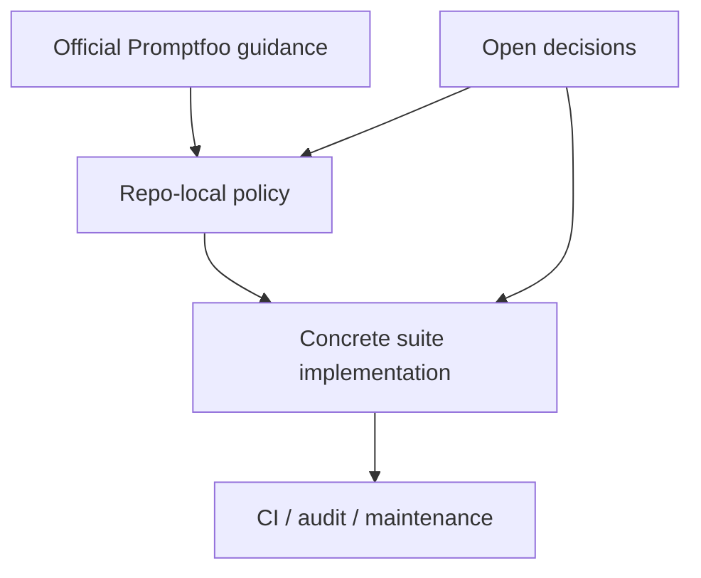

# Promptfoo Playbook

_A repo-usable playbook that separates **official Promptfoo guidance** from **repo-local policy** and **open team decisions**._

## Purpose

This document is intentionally split into three layers:

1. **Official Promptfoo guidance**  
   Guidance that is supported by Promptfoo's documentation and should be treated as tool behavior or officially recommended practice.

2. **Repo-local policy layered on top of Promptfoo**  
   Decisions for _this_ repository. These are compatible with Promptfoo, but they are **not** Promptfoo doctrine.

3. **Open decisions / team preferences**  
   Knobs that should be decided deliberately by the team instead of being mistaken for official best practice.

This separation exists to avoid a common failure mode:

- treating repo conventions as if Promptfoo mandated them, or
- treating Promptfoo capabilities as if they automatically imply a good local policy.

---

## How to use this playbook

Use this document in order:

1. **Read Section A** to understand what Promptfoo itself supports and recommends.
2. **Read Section B** to understand how this repo chooses to apply Promptfoo.
3. **Read Section C** before introducing new suites, new defaults, or a second eval runtime.

---

## Mermaid: three-layer model

---

# A. Official Promptfoo guidance

This section contains guidance that is grounded in Promptfoo's documented behavior and recommendations.

## A1. Prefer deterministic assertions first

Promptfoo supports a wide range of deterministic assertions. These should be the default when the expected behavior can be checked objectively.

### Use deterministic assertions first for:
- exact markers,
- routing envelopes,
- presence or absence of phrases,
- JSON shape and schema compliance,
- regex-based structure checks,
- simple numerical or metadata thresholds.

### Examples of first-choice assertions
- `contains`
- `icontains`
- `regex`
- `starts-with`
- `not-contains`
- `not-icontains`
- `is-json`
- `contains-json`
- `assert-set`

### Why
Deterministic assertions are:
- cheaper,
- faster,
- less noisy,
- easier to debug,
- and much more stable than model-graded checks.

### Rule
Do **not** reach for `llm-rubric` or other model-graded assertions if a deterministic assertion can verify the contract.

---

## A2. Keep prompts and tests file-based

Promptfoo supports loading prompts and test cases from files and globs. This is the preferred style for maintainable suites.

### Recommended
- keep `promptfooconfig*.yaml` light,
- store prompts under `prompts/`,
- store tests under `tests/`,
- store larger datasets externally.

### Avoid
- huge inline prompts,
- huge inline test arrays,
- config files that double as giant data stores.

### Why
File-based suites:
- are easier to review,
- reduce config noise,
- scale better,
- and make drift easier to audit.

---

## A3. Treat `file://` paths as config-relative

Promptfoo resolves `file://...` paths relative to the directory of the config file that references them.

### Rule
Never assume `file://` is resolved from:
- the current working directory,
- the repo root,
- or the shell location.

### Practical implication
Any suite that loads:
- prompts,
- tests,
- schemas,
- or artifacts through `file://`

must be validated from the perspective of the actual config directory.

### Audit question
If the config moves, do all `file://` references still resolve correctly?

---

## A4. Use `contains-json` and `is-json` for structured contracts

When the output includes structured JSON, Promptfoo gives you direct primitives to validate it.

### Prefer
- `is-json` when the output should be valid JSON,
- `contains-json` when valid JSON is embedded inside a broader text response,
- schema-backed JSON checks when structure matters.

### Why
This is the most direct way to test:
- output contracts,
- structured brief payloads,
- artifact envelopes,
- machine-readable sections.

### Rule
Do not replace structured validation with loose substring checks if JSON validity or schema shape is actually the requirement.

---

## A5. Use `assert-set` to express grouped requirements

`assert-set` is useful when a case needs multiple related checks that should be evaluated together.

### Good uses
- grouped stop-and-ask checks,
- grouped output envelope checks,
- grouped anti-hallucination checks,
- grouped structural constraints.

### Warning
`assert-set` becomes fragile if the group includes overly lexical checks.

### Rule
Inside an `assert-set`, prefer:
- semantic anchors,
- exact markers,
- artifact requirements,
- contract constraints.

Avoid overfitting to:
- politeness wording,
- specific prose style,
- one exact phrasing when many valid phrasings exist.

---

## A6. Use `promptfoo validate` as a required gate

Promptfoo provides `validate` to catch configuration and suite errors before full execution.

### Rule
Every suite should pass `promptfoo validate` before it is treated as runnable.

### Why
This catches:
- malformed config,
- bad paths,
- invalid assertions,
- broken references,
- schema mistakes.

### Policy implication
`validate` is not optional hygiene. It is the minimum bar for a suite to be considered live.

---

## A7. Distinguish retry, resume, and retry-errors

Promptfoo exposes recovery mechanisms, but they are not interchangeable.

### `--resume`
Use to continue a previously interrupted run.

### `--retry-errors`
Use to rerun only failed/erroring cases from a previous run.

### Retries
Use provider/runtime retries for transient API instability, not as a substitute for bad suite design.

### Rule
Do not blur these together:
- **resume** is continuity,
- **retry-errors** is targeted rerun,
- **provider retries** are transport/runtime resilience.

---

## A8. Tune concurrency and caching deliberately

Promptfoo supports concurrency and caching, but neither should be treated as invisible defaults.

### Concurrency
Higher concurrency improves throughput, but can worsen:
- rate limiting,
- flaky runs,
- provider instability,
- debugging clarity.

### Caching
Caching helps control cost and speed, but it can hide:
- prompt changes,
- suite wiring mistakes,
- false confidence when inputs drift.

### Rule
Concurrency and caching are performance tools, not truth tools.

---

## A9. For agentic systems, final text is not enough

Promptfoo's agent/coding-agent guidance makes an important distinction:
the final textual response is only part of the behavior.

### For agent or loop evaluation, use:
- `skill-used`
- `trajectory:tool-used`
- `trajectory:tool-sequence`
- `trajectory:tool-args-match`
- `trajectory:step-count`

### Why
Agentic systems can look correct in final prose while:
- using the wrong skill,
- calling the wrong tools,
- skipping critical validation steps,
- or taking an unstable execution path.

---

## A10. Use model-graded assertions only when objective checks are insufficient

Some behaviors cannot be captured cleanly with deterministic assertions.

### Valid reasons to use model-graded evaluation
- subtle semantic comparison,
- quality judgments where deterministic criteria are not enough,
- large or fuzzy artifacts where a strict parser is unrealistic.

### Requirements
If you use model-graded checks:
- fix the grader provider explicitly,
- pass the relevant reference context,
- keep the rubric narrow,
- and prefer them as a last resort.

### Rule
Do not use model-graded assertions as a shortcut for weak test design.

---

## A11. Treat coding-agent evals differently from prompt evals

Promptfoo documents coding-agent evaluation as a distinct problem.

### Differences
Coding-agent systems may involve:
- tools,
- iterative loops,
- multiple steps,
- artifacts in the workspace,
- traces that matter as much as final text.

### Implication
A coding-agent suite should often evaluate:
- outcome,
- skill/tool selection,
- trajectory,
- step count,
- and sometimes cost/latency.

---

## A12. Keep security and red-team concerns separate from correctness

Promptfoo also supports security-oriented and red-team style testing.

### Use security scans and attack-style evals for:
- prompt injection resistance,
- tool misuse,
- excessive agency,
- unsafe file or shell behavior,
- policy violations.

### Rule
Do not confuse:
- **correctness evals**,
- **routing/behavior evals**,
- **security evals**.

Each serves a different purpose.

---

# B. Repo-local policy layered on top of Promptfoo

This section defines how **this repo** chooses to use Promptfoo. These are policy choices, not Promptfoo mandates.

## B1. Promptfoo is the current eval authority

For this repo, Promptfoo is the primary runtime for evaluating the existing skill stack.

### Implication
New suite work should:
- fit the current Promptfoo surface,
- pass Promptfoo validation,
- and avoid introducing a second official eval authority by accident.

---

## B2. Family shape for skill suites

For forge-style skills in this repo, the canonical family shape is:

- `promptfooconfig.yaml`
- `promptfooconfig.uplift.with-skill.yaml`
- `promptfooconfig.uplift.without-skill.yaml`
- `prompts/`
- `tests/`

### Meaning
- **contract** checks the authoritative boundary,
- **uplift.with-skill** measures capability with the skill active,
- **uplift.without-skill** acts as a baseline and anti-impersonation guard.

### Important
This family shape is **repo policy**, not official Promptfoo doctrine.

---

## B3. Deterministic-first is mandatory for current forge skills

For the current forge families, the default assertion strategy is:

### First-choice assertions
- `icontains`
- `not-icontains`
- `regex`
- `starts-with`
- `contains-json`
- `is-json`
- `assert-set`

### Restricted assertions
- `javascript` only with justification,
- model-graded assertions only where deterministic checks cannot express the requirement.

### Why
The current forge skills have strong textual and artifact contracts, which are especially well-suited to deterministic checks.

---

## B4. `with-skill` prompts must not silently rewrite the skill contract

The `with-skill` prompt can reinforce the eval context, but it must not become a second source of truth for the skill.

### Rule
`with-skill.txt` may:
- remind the model about format or task framing,
- state eval-specific context,
- reinforce the current test setup.

It must **not**:
- redefine the skill boundary,
- introduce new blockers,
- widen the scope,
- or silently correct a weak `SKILL.md`.

### Audit question
If `SKILL.md` changed tomorrow, would `with-skill.txt` become a hidden contradictory contract?

---

## B5. `without-skill` suites must not impersonate the skill

The purpose of the baseline is not to produce a crippled copy of the skill. Its purpose is to show the delta when the skill is absent.

### `without-skill` should:
- avoid the skill's signature envelopes,
- avoid the skill's exact terminal markers,
- avoid pretending it has privileged authority or bundle context.

### Why
If the baseline imitates the skill too closely, uplift becomes noisy and misleading.

---

## B6. Stop-and-ask cases should be semantically strong, not lexically brittle

Current repo policy should favor semantic stop conditions over exact politeness formulas.

### Prefer checks about:
- missing authority,
- inaccessible artifacts,
- ambiguous target skill,
- phase mismatch,
- missing required input.

### Avoid overbinding to phrases like:
- "please provide"
- "please specify"
- "please separate"
- "clarify" as the only acceptable surface form

### Why
Overly lexical stop-and-ask checks create false failures for valid behavior.

---

## B7. Live semantic runs outrank offline replay

Repo policy: **live semantic behavior is the authority** when it conflicts with offline replay.

### Why
Offline replay is valuable for:
- fast iteration,
- regression triage,
- cheap smoke verification.

But it is still a snapshot and can drift from the current contract or provider behavior.

### Rule
Treat offline replay as:
- useful,
- cheap,
- operationally important,
- but not semantically supreme.

---

## B8. Promptfoo coverage should follow skill phase boundaries

The repo's skill stack is phase-separated.

### Therefore:
- contract evals should test contract behavior,
- implementation evals should test implementation-from-approved-contract behavior,
- eval-authoring evals should test eval-authoring behavior.

### Rule
Do not allow a suite to drift into evaluating multiple phases at once unless that coupling is intentional and explicitly documented.

---

## B9. The repo should maintain one obvious public Promptfoo surface

The repo should make it easy to answer:
- where Promptfoo suites live,
- how they are executed,
- which commands are canonical,
- and which conventions are required.

### Therefore the repo should maintain:
- one clear README surface,
- one Promptfoo playbook,
- stable documented entrypoints for validate/run,
- explicit guidance for family-specific direct-config execution,
- and explicit guidance about whether offline replay is supported, informative-only, or unsupported,
- and a clear statement of suite family shape.

---

## B10. Audit categories for this repo

Repo-specific audits should classify findings into:

1. **Wiring**
   - broken paths,
   - invalid schemas,
   - bad config references,
   - missing files.

2. **Semantic fragility**
   - lexical brittleness,
   - prompt/skill drift,
   - weak baselines,
   - mismatched phase boundaries.

3. **Reliability / operability**
   - flaky retries,
   - poor cache discipline,
   - unclear run modes,
   - missing recovery flow.

This classification is a repo convenience, not a Promptfoo requirement.

---

# C. Open decisions / team preferences

These are the areas that should be decided explicitly instead of being mistaken for official best practice.

## C1. Retry policy

Questions to decide:
- How many provider retries are acceptable by default?
- Which errors are retriable vs fail-fast?
- When should `retry-errors` be used in CI vs locally?

This is policy, not doctrine.

---

## C2. Concurrency defaults

Questions to decide:
- What should the default `-j` / concurrency be for live runs?
- Should offline and live use different defaults?
- When should concurrency be reduced for diagnosis?

There is no one universally correct value.

---

## C3. Cache policy

Questions to decide:
- When is cache allowed by default?
- When must cache be bypassed?
- Which runs are considered cache-sensitive?
- Should CI use different cache behavior than local iteration?

---

## C4. When to introduce trajectory assertions

Questions to decide:
- Should current forge suites stay mostly output-based?
- At what point does the future orchestrator require `skill-used` and trajectory checks?
- Which agent runs must be traced?

Promptfoo supports these checks, but the adoption point is a team design choice.

---

## C5. Whether Promptfoo remains the sole official eval runtime

Questions to decide:
- Is Promptfoo the long-term authority?
- Should Skillgrade be piloted as a second, non-authoritative harness?
- If Skillgrade is introduced, what remains the official gate?

This decision must be explicit to avoid dual source-of-truth drift.

---

## C6. Threshold design

Questions to decide:
- What pass rate is acceptable for smoke vs reliable vs regression runs?
- Which suites are hard-gating in CI?
- Which suites are informative only?

---

## C7. When JavaScript assertions are allowed

Questions to decide:
- What qualifies as "cannot be expressed cleanly with built-in assertions"?
- Does every JS assertion need a justification comment?
- Should JS assertions require fixture-based validation?

---

# Anti-patterns

Avoid these repeatedly:

- treating repo conventions as if Promptfoo mandated them,
- treating Promptfoo capabilities as if they automatically imply local policy,
- overusing model-graded assertions,
- stuffing tests inline when they belong in files,
- writing brittle `assert-set` groups that overfit exact phrasing,
- using baselines that mimic the skill too closely,
- relying on cache or retries to hide unstable suites,
- forgetting that config-relative `file://` paths are a source of real failure,
- evaluating agentic systems only by final prose,
- keeping two "official" eval runtimes without a clear authority.

---

# Minimal review checklist

Before considering a Promptfoo suite healthy, ask:

## Official Promptfoo layer
- Are deterministic assertions used wherever possible?
- Are file-based prompts/tests used?
- Do all `file://` references resolve relative to the config?
- Does `promptfoo validate` pass?
- Are model-graded checks narrowly justified?

## Repo policy layer
- Does the suite follow the repo family shape?
- Does `with-skill` reinforce rather than redefine the contract?
- Does `without-skill` avoid impersonating the skill?
- Are stop-and-ask cases semantically strong instead of lexically brittle?
- Is the phase boundary still clear?

## Open decisions layer
- Are retry/concurrency/cache settings intentional?
- Is it clear whether the run is authoritative or informative?
- Is it clear whether trajectory assertions are required?
- Is it clear whether Promptfoo is the only official gate for this suite?

---

# Bottom line

Promptfoo gives the repo:
- a powerful eval runtime,
- deterministic and agentic assertions,
- validation and recovery commands,
- and a clear file-based suite model.

This repo then adds:
- a skill-family convention,
- a baseline strategy,
- a phase-separated workflow,
- and local policy about what counts as authoritative.

Those two layers should stay separate in documentation, code review, and architecture discussions.
