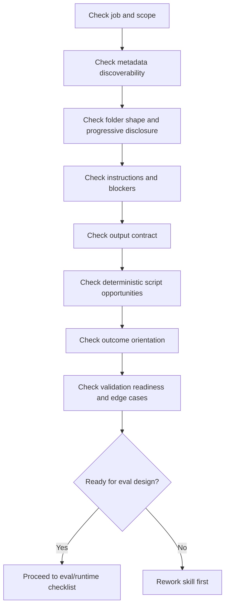

# Skill Authoring Audit Checklist

_A Phase 1 checklist for reviewing skill quality **without** Promptfoo or any other eval runner._

This checklist is grounded in two upstream sources:

- `mgechev/skills-best-practices`: lean skill structure, discovery-oriented metadata, progressive disclosure, procedural instructions, deterministic scripts, blocker handling, and LLM-based validation loops.
- `mgechev/skillgrade` / `skill-eval`: outcome-over-steps, explicit output contracts, grader validation, and starting with a small set of high-signal tasks.

Use this checklist **before** discussing Promptfoo, CI wiring, trajectory assertions, or runtime-specific eval mechanics.

---

## How to use this checklist

For each skill, mark every item as:

- `[x]` Pass
- `[~]` Partial / needs tightening
- `[ ]` Fail
- `N/A` Not applicable

Add a short note for every non-pass item.

---

## 1. Skill purpose and scope

- [ ] The skill has **one primary job**.
- [ ] The job has a **stable completion point**.
- [ ] The skill does **not** try to define, implement, evaluate, and redesign in one pass.
- [ ] The scope is narrow enough that a user can tell what the skill is **for**.
- [ ] The scope is narrow enough that the agent can tell what the skill is **not for**.
- [ ] The skill does not depend on hidden repo knowledge to understand its job.

**Fail if:** the skill reads like a generic helper, a mini-agent, or an open-ended consultant.

---

## 2. Discoverability: name and description

- [ ] `name` exactly matches the directory name.
- [ ] `name` uses lowercase letters, numbers, and hyphens only.
- [ ] `name` is concrete and domain-specific.
- [ ] `description` states **when to use** the skill.
- [ ] `description` states **when not to use** the skill.
- [ ] `description` includes nearby negative cases to reduce false triggers.
- [ ] `description` avoids vague labels like “helper”, “assistant”, or “tooling skill”.
- [ ] A new reviewer could guess the correct trigger cases from metadata alone.

**Fail if:** the description is broad enough that several unrelated prompts would trigger it.

---

## 3. Folder structure and packaging

- [ ] The skill folder is shallow and predictable.
- [ ] `SKILL.md` is the main control file.
- [ ] Support material is one level deep only.
- [ ] `references/` exists only when there is real supplementary material.
- [ ] `assets/` exists only when there are real templates/examples/static artifacts.
- [ ] `scripts/` exists only when there is fragile or repetitive work worth automating.
- [ ] There is no README-heavy sprawl inside the skill folder.
- [ ] There are no nested mini-projects or library-like trees under the skill.

**Fail if:** the skill looks like a miniature product instead of a focused execution package.

---

## 4. Progressive disclosure

- [ ] `SKILL.md` is lean enough to load cheaply.
- [ ] Dense schemas, examples, and templates live outside `SKILL.md`.
- [ ] `SKILL.md` explicitly tells the agent **when** to read support files.
- [ ] Support file references use explicit relative paths.
- [ ] The skill does not assume the agent will “know where to look”.
- [ ] Large static content is offloaded to `references/` or `assets/`.

**Fail if:** `SKILL.md` contains large embedded templates, giant JSON blobs, or long exception catalogs that should have been moved out.

---

## 5. Instruction quality

- [ ] The instructions are procedural, not essay-style.
- [ ] The core flow is step-by-step.
- [ ] Branch points are explicit.
- [ ] The skill uses stable terminology for the same concept throughout.
- [ ] The instructions are written for an agent, not for a human reader.
- [ ] The next action is obvious at every major step.
- [ ] The skill avoids vague verbs like “handle”, “improve”, or “fix appropriately” without criteria.

**Fail if:** a reviewer has to infer the order of operations or the meaning of key terms.

---

## 6. Inputs, authority, and prerequisites

- [ ] The authoritative input(s) are explicitly named.
- [ ] The skill makes clear what counts as an acceptable input source.
- [ ] The skill distinguishes between “mentioned” and “accessible/verifiable”.
- [ ] Preconditions are explicit.
- [ ] Unsupported project states are called out.
- [ ] Environment assumptions are visible.

**Fail if:** the skill can proceed only by guessing whether a referenced artifact is real, current, or authoritative.

---

## 7. Stop conditions and blockers

- [ ] The skill explicitly names the situations where it must stop.
- [ ] Ambiguous target handling is explicit.
- [ ] Missing authoritative input handling is explicit.
- [ ] Inaccessible file/artifact handling is explicit.
- [ ] Unsupported project shape handling is explicit.
- [ ] Destructive or high-risk operations require confirmation when appropriate.
- [ ] The skill prefers a clean stop over speculative continuation.

**Fail if:** the agent is likely to improvise through ambiguity instead of stopping cleanly.

---

## 8. Output contract

- [ ] The expected output artifact is explicit.
- [ ] Required filenames are explicit.
- [ ] Required output structure is explicit.
- [ ] Required terminal markers are explicit.
- [ ] Validation commands are named when mandatory.
- [ ] The skill does not rely on the agent to infer the output contract.

**Fail if:** the evaluator or reviewer expects a file/marker/shape that the skill never explicitly requested.

---

## 9. Deterministic helpers and scripts

- [ ] Fragile work is moved into scripts when appropriate.
- [ ] Scripts are tiny and single-purpose.
- [ ] Scripts behave like CLIs, not hidden frameworks.
- [ ] Script stdout/stderr is descriptive enough for agent self-correction.
- [ ] Scripts do not hide dangerous side effects.
- [ ] Scripts are only used where they reduce variance or prevent brittle reasoning.

**Fail if:** repetitive parsing/rewriting/validation is left to free-form model generation even though it could be scripted cheaply.

---

## 10. Outcome orientation

- [ ] The skill is framed around the final useful artifact or decision.
- [ ] Internal ritual is not treated as the goal.
- [ ] The skill does not overprescribe irrelevant command choices.
- [ ] Success can be described in terms of outcomes, not only steps.

**Fail if:** the skill is effectively a recipe for tool usage rather than a recipe for producing the right result.

---

## 11. Validation readiness

- [ ] The skill can be discovery-tested from metadata alone.
- [ ] The skill can be logic-simulated step by step without hidden assumptions.
- [ ] A reviewer can identify likely edge cases from the instructions.
- [ ] The skill has at least a few obvious high-signal task examples that could later become evals.
- [ ] The skill is narrow enough that failures can be attributed to the skill, not to vague scope.

**Fail if:** you cannot imagine 3–5 concrete tasks that would meaningfully test the skill.

---

## 12. Edge-case resilience

- [ ] The skill addresses likely unsupported configurations.
- [ ] The skill addresses partial or missing inputs.
- [ ] The skill addresses ambiguous naming or references.
- [ ] The skill addresses likely mismatch between expected and actual repo shape.
- [ ] The skill makes fallback or stop behavior visible.

**Fail if:** basic adversarial questions immediately expose missing branches.

---

## 13. Anti-pattern check

Mark any anti-patterns present:

- [ ] Vague name
- [ ] Vague description
- [ ] Over-broad scope
- [ ] Bloated `SKILL.md`
- [ ] Hidden assumptions
- [ ] Inconsistent terminology
- [ ] Missing blocker handling
- [ ] Implicit output contract
- [ ] No exact completion signal
- [ ] Too much logic delegated to free-form reasoning
- [ ] Support files exist but are never explicitly referenced
- [ ] Reads like human documentation, not executable instructions

If any box is checked here, the skill needs revision.

---

## 14. Audit verdict

Choose one:

- [ ] **Accept** — the skill is structurally sound and narrow enough to evaluate.
- [ ] **Accept with revisions** — the skill is viable but has local weaknesses.
- [ ] **Rework before evals** — the skill is too ambiguous/broad to evaluate reliably.

### Mandatory notes

- **Primary risk:**
- **Most important missing blocker:**
- **Most important missing output contract detail:**
- **Most important drift/bloat issue:**
- **Should this stay a skill at all?** yes / no

---

## Recommended review flow

---

## Reviewer note

Do **not** move to Promptfoo, Skillgrade, or any eval harness discussion until the skill passes this checklist. A weak skill wrapped in a strong eval runner is still a weak skill.
