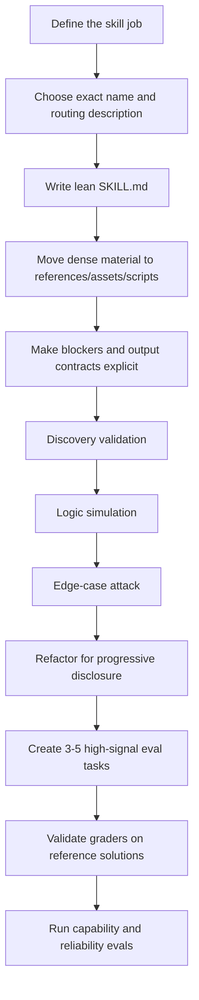

# Skill Authoring Playbook

_A practical, harness-agnostic playbook distilled from `mgechev/skills-best-practices` and the `skillgrade` README._

## Purpose

This playbook defines how to write agent skills that are:

- easy for the agent to discover,
- cheap to load,
- deterministic to execute,
- easy to validate,
- and resilient to edge cases.

It is intentionally **agnostic of the eval runner**. You can apply it whether you evaluate with Promptfoo, Skillgrade, or another harness.

---

## 1. Treat a skill as a small executable system

A skill is **not** a human-facing mini-manual. It is a compact execution package for an agent.

A good skill has four properties:

1. **Discoverable** — the agent can route to it from metadata alone.
2. **Lean** — only the minimum context is loaded up front.
3. **Procedural** — instructions are operational, not essay-like.
4. **Deterministic where it matters** — repetitive or fragile work is pushed into scripts.

---

## 2. Keep the directory shallow and predictable

Preferred structure:

```text
skill-name/
├── SKILL.md      # Required: metadata + core instructions
├── scripts/      # Tiny CLIs for deterministic or fragile operations
├── references/   # Supplementary docs, schemas, cheatsheets
└── assets/       # Templates, static files, example outputs
```

### Rules

- `SKILL.md` is the **brain**: routing intent, workflow, and high-level procedures.
- `references/` holds supporting material the agent reads only when instructed.
- `scripts/` is for tiny executable helpers, not shared library code.
- `assets/` is for templates, schemas, examples, and output scaffolds.
- Keep support files **one level deep**.

### Do not add

- `README.md`
- `CHANGELOG.md`
- `INSTALLATION_GUIDE.md`
- nested resource trees that force extra traversal
- long-lived library code inside `scripts/`

---

## 3. Optimize frontmatter for discovery

The metadata in `SKILL.md` is the **only thing the agent sees before deciding whether to load the skill**.

### Naming

- Use **lowercase letters, numbers, and hyphens** only.
- Avoid consecutive hyphens.
- The `name` must exactly match the parent directory name.
- Keep the name concrete and domain-specific.

### Description

The description must do routing work, not marketing work.

It should:

- describe the capability in the **third person**,
- say **when to use** the skill,
- say **when not to use** it,
- include nearby negative cases to reduce false triggers,
- avoid vague labels like “React skill” or “testing helper”.

### Good pattern

```yaml
---
name: angular-vite-migrator
description: Migrates Angular CLI projects from Webpack to Vite and esbuild. Use when the user wants to replace Angular builders, migrate custom webpack logic, or speed up Angular builds. Do not use for React, Vue, or generic Angular version upgrades.
---
```

---

## 4. Use progressive disclosure aggressively

The main file should stay small and only contain what the agent must know early.

### Rules

- Keep `SKILL.md` lean.
- Move dense rules, schemas, examples, or templates into `references/` or `assets/`.
- Explicitly tell the agent **when** to read a supporting file.
- Use **relative paths with forward slashes** everywhere.

### Good pattern

Instead of embedding a long JSON schema in `SKILL.md`:

```md
Read `references/eval-brief-schema.md` before validating the brief payload.
```

Instead of describing a large output structure in prose:

```md
Copy the structure from `assets/eval-brief.template.json`.
```

### Anti-pattern

- stuffing templates, schemas, and exception tables directly into `SKILL.md`
- relying on the agent to “know where to look” without explicit pathing

---

## 5. Write procedures, not prose

Instructions should be written for an LLM acting as an executor.

### Preferred style

- numbered steps,
- chronological order,
- explicit branch points,
- imperative voice,
- stable terminology.

### Good pattern

```md
1. Inspect the approved brief.
2. If the brief is not accessible and verifiable, stop and ask for it.
3. Read `references/package-shape.md` before creating files.
4. Materialize the minimum skill bundle.
5. Run `scripts/validate-metadata.py`.
6. End with `Skill implementation ready`.
```

### Anti-pattern

- long narrative paragraphs
- vague instructions like “carefully improve the implementation”
- switching terms for the same concept

### Terminology discipline

Pick one term per concept and keep it stable:

- `approved brief`, not sometimes `contract`, sometimes `brief`, sometimes `spec`
- `template`, not `sample`, `shape`, `skeleton`, and `format` interchangeably

---

## 6. Push fragile work into deterministic scripts

Do not ask the model to repeatedly improvise parsing, transformation, or boilerplate-heavy work.

### Use `scripts/` for

- parsing structured files,
- schema validation,
- file rewrites with strict rules,
- deterministic extraction,
- repetitive conversions,
- fragile command sequences.

### Script design rules

- keep scripts tiny and single-purpose,
- treat them like CLIs,
- print clear success/failure messages,
- return actionable error messages,
- make edge cases obvious in stdout/stderr,
- avoid hidden side effects.

A script should help the agent self-correct without asking the user for help unnecessarily.

---

## 7. Design for execution blockers explicitly

A robust skill makes it easy for the agent to detect when it **cannot safely continue**.

### Add explicit blockers for

- missing authoritative input,
- ambiguous target skill or artifact,
- inaccessible referenced files,
- unsupported project states,
- missing environment assumptions,
- destructive actions requiring confirmation.

### Good pattern

```md
If the target skill is ambiguous, stop and ask for the exact skill name.
If the approved brief is mentioned but not accessible, stop and ask for the materialized artifact.
If the project shape does not match the expected package layout, stop and report the mismatch.
```

A strong skill is not one that always continues. It is one that **continues correctly or stops cleanly**.

---

## 8. Make output contracts explicit

If you expect a file, artifact, marker, or schema, name it directly.

### Rules

- name exact output files,
- name exact terminal markers,
- name exact JSON structures when required,
- name exact validation commands when mandatory,
- do not rely on implication.

### Good pattern

```md
Write the brief in the structure defined by `assets/eval-brief.template.json`.
Finish with the exact line: `Eval Brief ready`.
```

### Anti-pattern

- “produce the right JSON shape”
- “leave a completion message”
- “save the output appropriately”

If an evaluator or grader checks for `output.html`, the instruction must say `output.html`.

---

## 9. Keep skills narrow

A skill should do **one job well**.

### Good scope

- define or refactor a skill contract,
- implement a skill from an approved contract,
- author eval coverage for a specific implemented skill,
- audit a Promptfoo family against a repo playbook.

### Bad scope

- define, implement, evaluate, and redesign architecture in one pass,
- “help with front-end work”,
- “do Promptfoo things”,
- broad advisory skills that have no stable completion point.

### Heuristic

If you cannot write a clean terminal condition, the skill is probably too broad.

---

## 10. Validate discovery before validating logic

Before testing full execution, first test whether the metadata triggers the skill correctly.

### Discovery validation

Test the `name` and `description` in isolation.

Ask an LLM to generate:

- prompts that **should** trigger the skill,
- prompts that **should not** trigger the skill,
- a critique and rewrite of the description.

This catches false triggers early.

---

## 11. Validate logic by simulating execution

Once discovery looks good, validate whether the instructions are actually executable.

### Logic validation prompt pattern

Give the model:

- the full `SKILL.md`,
- the directory tree,
- the supporting file names,
- a concrete request.

Then ask it to simulate execution step by step and flag:

- where it has to guess,
- where a file is missing,
- where the procedure is ambiguous,
- where the next action is not obvious.

This is a strong way to identify hallucination pressure.

---

## 12. Attack the skill with edge cases

Do not only test the happy path.

### Ask for 3–5 hard questions about

- unsupported configurations,
- legacy project states,
- conflicting assumptions,
- environmental dependencies,
- fallback behavior,
- partial failure modes.

The goal is to expose missing branches, not to immediately patch them.

---

## 13. Refactor for progressive disclosure after edge-case review

A common failure mode is a bloated `SKILL.md` that tries to hold everything.

After edge-case review:

- move dense material out of `SKILL.md`,
- replace it with precise “read this file now” instructions,
- add a compact error-handling section,
- keep the main flow readable and branchable.

---

## 14. Evaluate skills by outcome, not ritual

This comes directly from the `skillgrade` README and should be treated as a core rule.

### Rules

- grade outcomes, not steps,
- check whether the artifact is correct,
- do not require that the agent used a specific command unless command choice is itself the capability under test.

### Example

Good evaluation target:

- the file was created correctly,
- the JSON is valid,
- the repo layout is compliant,
- the marker is exact.

Bad evaluation target:

- the agent ran `jq` specifically,
- the agent opened files in a preferred order when the order is irrelevant,
- the agent used your favorite shell command.

---

## 15. Validate graders before trusting eval results

Another explicit `skillgrade` rule: **validate graders first**.

### Rules

- create or capture a known-good reference solution,
- run deterministic graders against it,
- verify that they pass for the right reasons,
- verify that they fail on a known-bad sample,
- only then run full agent evals.

A bad grader creates false confidence.

---

## 16. Start with a tiny, high-signal eval set

Again, directly aligned with the `skillgrade` README.

### Rules

- start with **3–5 well-designed tasks**,
- prefer high-signal representative tasks,
- avoid inflating the suite too early,
- add regressions only after observing real failures.

More tasks do not automatically mean better coverage. Early on, they often mean more noise.

---

## 17. Separate capability, reliability, and regression

Do not treat all runs the same.

### Capability checks

Use a small number of trials for quick feedback.

### Reliability checks

Increase trials to estimate pass rate more confidently.

### Regression checks

Use the most stable and valuable tasks at a higher confidence level.

This separation prevents overpaying for routine feedback while still protecting against regressions.

---

## 18. Distinguish authoring guidance from repo policy

A skill should not carry the whole governance model of the repository.

### Put in the skill

- the workflow,
- the blockers,
- the required artifacts,
- the exact completion condition,
- references to supporting files.

### Put outside the skill

- repo-wide conventions,
- global naming policy,
- CI policy,
- runner-specific details,
- broad architectural doctrine.

That material belongs in playbooks, repo docs, or tooling.

---

## 19. Anti-patterns

Avoid these repeatedly:

- vague names and vague descriptions,
- skills that try to do multiple jobs,
- bloated `SKILL.md` files,
- nested resource trees,
- human-oriented prose instead of executable steps,
- inconsistent terminology,
- forcing the model to improvise fragile parsing logic,
- implicit output contracts,
- evaluating tool ritual instead of useful outcomes,
- adding lots of weak eval tasks too early,
- trusting unvalidated graders.

---

## 20. Review checklist

Before calling a skill “ready”, check:

- Does the name exactly match the directory?
- Is the description precise enough to route correctly?
- Does the description include negative triggers?
- Is `SKILL.md` lean and procedural?
- Are support files one level deep?
- Does `SKILL.md` explicitly tell the agent when to read support files?
- Are outputs and terminal markers explicit?
- Are blockers explicit?
- Are fragile operations offloaded to scripts?
- Can the logic be simulated without guessing?
- Have edge cases been deliberately attacked?
- Do evals check outcomes rather than rituals?
- Have graders been validated with known-good and known-bad samples?
- Does the eval set start small and high-signal?

---

## Mermaid: recommended skill lifecycle



---

## Bottom line

A strong skill is:

- easy to discover,
- cheap to load,
- clear to execute,
- explicit about blockers,
- deterministic where variation is harmful,
- and evaluated by the quality of its outcome.
